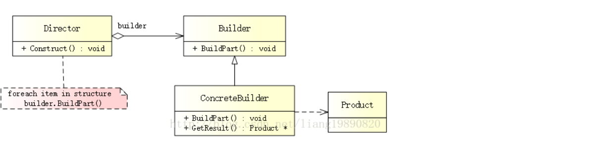
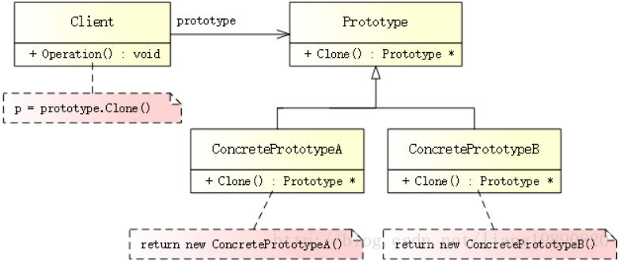

简介

https://blog.csdn.net/liang19890820/article/details/66974516

设计模式的作用就是从变化和稳定之间寻找一个隔离点，分离它们，从而管理变化。

Template method(模板模式)

**模式定义：**

定义一系列算法，把它们一个个封装起来，并且使它们可互相替代（变化），改模式使得算法可独立于使用它的客户程序（稳定）而变化（扩展，子类化）、

变化是复用的天敌，面向对象设计最大的优势在于：抵御变化

面向对象： 隔离变化，各司其职、对象

### 开放封闭原则（OCP）

- 对扩展开发，对更改封闭
- 类模块应该是可扩展的，但是不可修改

### 单一责任原则（SRP）

- 一个类应该仅有一个引起它变化的原因
- 变化的方向隐含着类的责任

### Liskov 替换原则（LSP）

- 子类必须能够替换它们的基类（IS-A）
- 继承表达类型抽象

### 接口隔离原则（ISP)

- 不应该强迫客户程序依赖它们不同的方法。
- 接口应该小而完备。

### 优先使用对象组合，而不是类继承

- 类继承通常为“白箱复用”，对象组合通常为“黑箱复用”。
- 继承在某种程度上破坏了封装性，子类父类耦合度高
- 而对象组合则只要求被组合的对象具有良好定义的接口，耦合度低。

### 封装变化点

- 使用封装来创建对象之间的分界层，让设计者可以在分界的一侧进行修改，而不会对另一侧产生不良的影响，从而实现不同层次间的松耦合。

### 针对接口编程，而不是针对实现编程

- 不将变量类型声明为某个特定的具体类，而是声明为某个接口。
- 客户程序无需获知对象的具体类型，只需要知道对象所具有的接口
- 减少系统中各部分的依赖关系，从而实现“高内聚、松耦合” 的类型设计方案。

### 模式的分类

|类型	|描述|
|----------------|----------------|
|创建型模式（Creational Patterns）|	用于构建对象，以便它们可以从实现系统中分离出来。|
|结构型模式（Structural Patterns）|	用于在许多不同的对象之间形成大型对象结构。|
|行为型模式（Behavioral Patterns）| 用于管理对象之间的算法、关系和职责。 |


### 组件协作模式：

- template Method
- strategy
- observe /Event


## 单例模式

保证一个类仅有一个实例，并提供一个该实例的全局访问点。

- 创建一个类，这个类永远只能生成一个实例。

```C++
class singleton
{
public:
	static singleton* getinstance();
  singleton* m_pInstance;
private:
  //不声明默认构造函数和拷贝构造函数，编译器会自动生成，所有这里我们自己声明在私有的吗，外部就不能调用了。
  singleton(); 
  singleton(const singleton&);
}
```


```C++
//单进程使用 线程不安全
singleton* singleton::getinstance()
{
	if(m_pInstance == NULL)
    {
        //如果多个线程同时进入这里，这时就会产生多个实例
        m_pInstance = new singleton();
    }
	return m_pInstance
}
```


```C++
//考虑多线程 加锁
//进入函数进行加锁，函数执行完锁变量释放，下个线程就能继续执行函数
singleton* singleton::getinstance()
{	
    Lock lock； //加锁 调用函数都需要加锁 消耗太大了
	if(m_pInstance == NULL)
	{
        m_pInstance = new singleton();
    }
	return m_pInstance
}
//锁释放
```

双检查锁

```C++
//双检查锁 懒汉模式
singleton* singleton::getinstance()
{	
    if(m_pInstance == NULL)
    {
        Lock lock； //加锁  最差情况下会阻塞几个线程，只有实例创建完成，之后所有调用这个函数，不会加锁了
        if(m_pInstance == NULL)
        {
            m_pInstance = new singleton();
        }      
    } 
	return m_pInstance
}
```

饿汉模式

```C++
#include <iostream>
using namespace std;

class singleton
{
public:
	static singleton* getinstance();
  	static singleton* m_pInstance; //将实例指针定义为static，在程序一开始运行就会执行它的初始化，它的生命周期是伴随整个程序。
private:
  //不声明默认构造函数和拷贝构造函数，编译器会自动生成，所有这里我们自己声明在私有的吗，外部就不能调用了。
  singleton(); 
  singleton(const singleton&);
}
singleton* singleton::m_pInstance = new singleton();

singleton* singleton::getinstance()
{
	return m_pInstance;
}

//缺点：消耗内存（长期占用内存）
```


## 简单工厂模式

简单工厂模式又称为静态工厂模式，通过一个类来负责创建其他类的实例，被创建的实例一般都是继承同一个类。

优点：通过一个工厂类来实现具体产品的创建，隐藏的产品类的实现，不需要知道具体产品类。

缺点：增加产品，需要修改工厂类，扩展性并不好。

```C++
//工厂
class Factory
{
	//创建一个静态方法实例化其他的类
    static Fruit* create(string name)
    {
        Fruit * temp = NULL;
        if(strcmp(name,"Banana"))
        {
            temp = new Banana();
        }
        else if(strcmp(name,"Pear"))
        {
            temp = new Pear();
        }
        return tmep;
    }
}

class Fruit
{
    //.....
    virtual show() = 0; //纯虚函数
}

class Banana:public Fruit
{
	//.....
	virtual void show()  //子类重写函数可以省略 virtual
	{
		cout<<"I am Banana"<<endl;
	}
}

class Pear:public Fruit
{
	//.....
	virtual void show()  //子类重写函数可以省略 virtual
	{
		cout<<"I am Pear"<<endl;
	}
}

int main()
{
    
    Fruit *p = Factory::create("Banana");
    p->show(); //输出I am Banana
    return 0;
}
```


## 工厂模式

是一种常用的对象创建型设计模式，此模式的核心思想是封装类中不变的部分，提取其中个性化善变的部分为独立类，通过依赖注入以达到解耦、复用以及方便后期维护拓展的目的。

>  一个工厂对应一个产品.

1) 从简单工厂模式到工厂模式

由于简单工厂模式违背的开发封闭原则，工厂模式就是对简单工厂模式演进。

将核心的一个工厂类，变成一个抽象的接口，使用它的子类进行创建产品。


优点：系统在不需要修改具体的工厂的情况下增加的新的产品。

缺点：创建一个新的产品需要增加一个新的工厂,加大了额外的开发量。

```C++
//产品抽象类
class abstractFruit
{
    virtual show() = 0;
}
//工厂抽象类
class abstactFactory
{
    virtual abstractFruit*  create() = 0;
}
//产品A类
class Banana : public abstractFruit
{
	virtual show()
	{
		cout<<"I am Banana"<<endl;
	}
}

//工厂A类
class BananaFactory : public abstactFactory
{
	virtual abstractFruit* create()
	{
		return new Banana;
	}
}
//产品Pear
class Pear :  public abstractFruit
{
	virtual show()
	{
		cout<<"I am Pear"<<endl;
	}
}

//工厂PearFactory
class PearFactory : public abstactFactory
{
	virtual abstractFruit* create()
	{
		return new Pear;
	}
}

int main()
{
    //先创建工厂，在通过工厂创建产品
    abstactFactory *pFactory = new  BananaFactory;
    abstractFruit * pFruit = pFactory->create();
    pFruit->show(); // output::I am Banana 
    /*
    .
    .
    .
    */    
    return 0;
}
```


## 抽象工厂模式

我们将具有相同属性的产品，放到一个工厂中生产。（产品族的工厂）

**1）工厂模式和抽象工厂模式的区别**

工厂模式是一个类只能生产一个产品

抽象工厂模式是一个类可以生产多个产品

```C++
class BaseFactory
{
}

class BaseProduct
{
}
class southapple:public BaseProduct
{
}
class southbanana:public BaseProduct
{}

class southFactory:public BaseFactory
{
		BaseProduct * getapple()
		{
			return new southapple();
		}
		BaseProduct * getbanana()
		{
			return new southbanana();
		}
}

int main()
{
	BaseFactory* ptrFactory= new southFactory();
    BaseProduct* ptrProduct = ptrFactory->getapple();
    BaseProduct* ptrProduct = ptrFactory->getbanana();    
    return 0;
}
```


## 建造者模式



- Builder（抽象建造者）：为创建一个产品对象的各个部件指定抽象接口

- ConcreateBuilder(具体建造者)：实现builder的接口以构造和装配该产品的各个部件，定义并明确它所创建的表示，并提供一个检索产品的接口。

- Director（指挥者）：构造一个使用Builder接口的对象

- Product（产品）：表示被构造的复杂对象，ConcreteBuilder创建该产品的内部表示并定义它的装配过程，包含定义组成部件的类，包含将这些部件装配成最终产品的接口。

  

房子

```C++
class house
{
public:
    void setlength(int length)
    {
        this->length = length;
    }
    
    void setwidth(int width)
    {
        this->width = width;
    }
    
    void setheight(int height)
    {
        this->height = height;
    }
private:
    int length;
    int width;
    int height;
}
//建造者抽象类
class Builder
{
	virtual void setlength() = 0;
    virtual void setwidth() = 0;
    virtual void setheight() = 0;
    virtual house *GetHouse() = 0;
}
//产品A建造者
class BuilderA : public Builder
{
	//建造具体的产品
}
//产品B建造者
class BuilderB : public Builder
{
	//建造具体的产品
}

//指挥者
class Director
{
    void Construct(Builder * builder)
    {
        builder->setlength();
        builder->setwidth();
        builder->setheight();
    }
}


```

原型模式
---

用原型实例指定创建对象的种类，并且通过拷贝这个原型来创建的对象。




- Prototype(抽象原型)：定义了克隆自身多接口。
- ConcretePrototype（具体原型）：被复制的对象，需要实现Prototype定义的接口


## 装饰模式

- 在不改变原始类和使用继承的情况下，动态的扩展一个对象的功能。

- 就是把需要添加的附加功能分别放在单独的类，并让这个类包含它要装饰的对象。

- 客户端可以有选择、按顺序的的装饰功能包装对象。


## 桥模式

## 简介

https://blog.csdn.net/liang19890820/article/details/66974516

设计模式的作用就是从变化和稳定之间寻找一个隔离点，分离它们，从而管理变化。

Template method(模板模式)

**模式定义：**

定义一系列算法，把它们一个个封装起来，并且使它们可互相替代（变化），改模式使得算法可独立于使用它的客户程序（稳定）而变化（扩展，子类化）、

变化是复用的天敌，面向对象设计最大的优势在于：抵御变化

面向对象： 隔离变化，各司其职、对象

### 开放封闭原则（OCP）

- 对扩展开发，对更改封闭
- 类模块应该是可扩展的，但是不可修改

### 单一责任原则（SRP）

- 一个类应该仅有一个引起它变化的原因
- 变化的方向隐含着类的责任

### Liskov 替换原则（LSP）

- 子类必须能够替换它们的基类（IS-A）
- 继承表达类型抽象

### 接口隔离原则（ISP)

- 不应该强迫客户程序依赖它们不同的方法。
- 接口应该小而完备。

### 优先使用对象组合，而不是类继承

- 类继承通常为“白箱复用”，对象组合通常为“黑箱复用”。
- 继承在某种程度上破坏了封装性，子类父类耦合度高
- 而对象组合则只要求被组合的对象具有良好定义的接口，耦合度低。

### 封装变化点

- 使用封装来创建对象之间的分界层，让设计者可以在分界的一侧进行修改，而不会对另一侧产生不良的影响，从而实现不同层次间的松耦合。

### 针对接口编程，而不是针对实现编程

- 不将变量类型声明为某个特定的具体类，而是声明为某个接口。
- 客户程序无需获知对象的具体类型，只需要知道对象所具有的接口
- 减少系统中各部分的依赖关系，从而实现“高内聚、松耦合” 的类型设计方案。

### 模式的分类

|类型	|描述|
|----------------|----------------|
|创建型模式（Creational Patterns）|	用于构建对象，以便它们可以从实现系统中分离出来。|
|结构型模式（Structural Patterns）|	用于在许多不同的对象之间形成大型对象结构。|
|行为型模式（Behavioral Patterns）| 用于管理对象之间的算法、关系和职责。 |


### 组件协作模式：

- template Method
- strategy
- observe /Event


## 单例模式

保证一个类仅有一个实例，并提供一个该实例的全局访问点。

- 创建一个类，这个类永远只能生成一个实例。

```C++
class singleton
{
public:
	static singleton* getinstance();
  singleton* m_pInstance;
private:
  //不声明默认构造函数和拷贝构造函数，编译器会自动生成，所有这里我们自己声明在私有的吗，外部就不能调用了。
  singleton(); 
  singleton(const singleton&);
}
```


```C++
//单进程使用 线程不安全
singleton* singleton::getinstance()
{
	if(m_pInstance == NULL)
    {
        //如果多个线程同时进入这里，这时就会产生多个实例
        m_pInstance = new singleton();
    }
	return m_pInstance
}
```


```C++
//考虑多线程 加锁
//进入函数进行加锁，函数执行完锁变量释放，下个线程就能继续执行函数
singleton* singleton::getinstance()
{	
    Lock lock； //加锁 调用函数都需要加锁 消耗太大了
	if(m_pInstance == NULL)
	{
        m_pInstance = new singleton();
    }
	return m_pInstance
}
//锁释放
```

双检查锁

```C++
//双检查锁 懒汉模式
singleton* singleton::getinstance()
{	
    if(m_pInstance == NULL)
    {
        Lock lock； //加锁  最差情况下会阻塞几个线程，只有实例创建完成，之后所有调用这个函数，不会加锁了
        if(m_pInstance == NULL)
        {
            m_pInstance = new singleton();
        }      
    } 
	return m_pInstance
}
```

饿汉模式

```C++
#include <iostream>
using namespace std;

class singleton
{
public:
	static singleton* getinstance();
  	static singleton* m_pInstance; //将实例指针定义为static，在程序一开始运行就会执行它的初始化，它的生命周期是伴随整个程序。
private:
  //不声明默认构造函数和拷贝构造函数，编译器会自动生成，所有这里我们自己声明在私有的吗，外部就不能调用了。
  singleton(); 
  singleton(const singleton&);
}
singleton* singleton::m_pInstance = new singleton();

singleton* singleton::getinstance()
{
	return m_pInstance;
}

//缺点：消耗内存（长期占用内存）
```


## 简单工厂模式

简单工厂模式又称为静态工厂模式，通过一个类来负责创建其他类的实例，被创建的实例一般都是继承同一个类。

优点：通过一个工厂类来实现具体产品的创建，隐藏的产品类的实现，不需要知道具体产品类。

缺点：增加产品，需要修改工厂类，扩展性并不好。

```C++
//工厂
class Factory
{
	//创建一个静态方法实例化其他的类
    static Fruit* create(string name)
    {
        Fruit * temp = NULL;
        if(strcmp(name,"Banana"))
        {
            temp = new Banana();
        }
        else if(strcmp(name,"Pear"))
        {
            temp = new Pear();
        }
        return tmep;
    }
}

class Fruit
{
    //.....
    virtual show() = 0; //纯虚函数
}

class Banana:public Fruit
{
	//.....
	virtual void show()  //子类重写函数可以省略 virtual
	{
		cout<<"I am Banana"<<endl;
	}
}

class Pear:public Fruit
{
	//.....
	virtual void show()  //子类重写函数可以省略 virtual
	{
		cout<<"I am Pear"<<endl;
	}
}

int main()
{
    
    Fruit *p = Factory::create("Banana");
    p->show(); //输出I am Banana
    return 0;
}
```


## 工厂模式

是一种常用的对象创建型设计模式，此模式的核心思想是封装类中不变的部分，提取其中个性化善变的部分为独立类，通过依赖注入以达到解耦、复用以及方便后期维护拓展的目的。

>  一个工厂对应一个产品.

1) 从简单工厂模式到工厂模式

由于简单工厂模式违背的开发封闭原则，工厂模式就是对简单工厂模式演进。

将核心的一个工厂类，变成一个抽象的接口，使用它的子类进行创建产品。


优点：系统在不需要修改具体的工厂的情况下增加的新的产品。

缺点：创建一个新的产品需要增加一个新的工厂,加大了额外的开发量。

```C++
//产品抽象类
class abstractFruit
{
    virtual show() = 0;
}
//工厂抽象类
class abstactFactory
{
    virtual abstractFruit*  create() = 0;
}
//产品A类
class Banana : public abstractFruit
{
	virtual show()
	{
		cout<<"I am Banana"<<endl;
	}
}

//工厂A类
class BananaFactory : public abstactFactory
{
	virtual abstractFruit* create()
	{
		return new Banana;
	}
}
//产品Pear
class Pear :  public abstractFruit
{
	virtual show()
	{
		cout<<"I am Pear"<<endl;
	}
}

//工厂PearFactory
class PearFactory : public abstactFactory
{
	virtual abstractFruit* create()
	{
		return new Pear;
	}
}

int main()
{
    //先创建工厂，在通过工厂创建产品
    abstactFactory *pFactory = new  BananaFactory;
    abstractFruit * pFruit = pFactory->create();
    pFruit->show(); // output::I am Banana 
    /*
    .
    .
    .
    */    
    return 0;
}
```


## 抽象工厂模式

我们将具有相同属性的产品，放到一个工厂中生产。（产品族的工厂）

**1）工厂模式和抽象工厂模式的区别**

工厂模式是一个类只能生产一个产品

抽象工厂模式是一个类可以生产多个产品

```

```


## 建造者模式


## 装饰模式

- 在不改变原始类和使用继承的情况下，动态的扩展一个对象的功能。

- 就是把需要添加的附加功能分别放在单独的类，并让这个类包含它要装饰的对象。

- 客户端可以有选择、按顺序的的装饰功能包装对象。


## 桥模式

