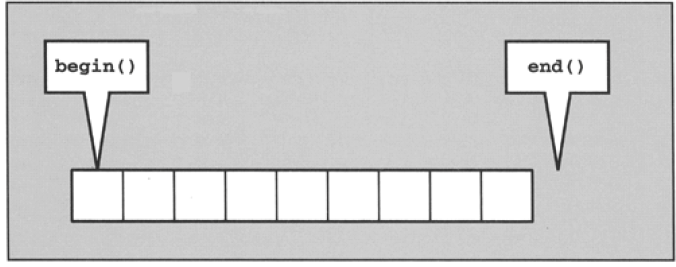

# STL

## 组成

- 容器（containers）
- 算法（algorithms)
- 迭代器（iterators）
- 仿函数（function）
- 配接器（adapter）
- 空间配置器（allocator）

## 容器（containers）

1.序列式容器（sequence containers)：元素都是可序（ordered）,但未必是有序（sorted），如：array，vector

2.关联式容器（associattive containers)：如：list，map

## 算法（algorithms)

```

```


## 迭代器（iterators）

所有的容器都定义了自己的迭代器类型，所以一般情况下，不需要再自己添加迭代器头文件。但是如果要使用一些特殊的迭代器，如反向迭代器，或者一些迭代器辅助函数，那么就需要添加头文件<iterator>。

### 迭代器类型

| **类型**       | **能力**               | **提供者**                              |
| -------------- | ---------------------- | --------------------------------------- |
| 输入迭代器     | 一次向前读取           | istream                                 |
| 输出迭代器     | 向前写入               | ostream,inserter                        |
| 前向迭代器     | 向前读取和写入         | forward list,unordered containers       |
| 双向迭代器     | 向前和向后的读取和写入 | list,set,multiset,map,multimap          |
| 随机存取迭代器 | 随机读取和写入         | array,vector,deque,string,C-style array |

**迭代器运算中，++iter比iter++更快，所以最好选用++iter**




### 输入迭代器

```
*iter //读取实际元素

iter ->member //读取实际元素的成员

++iter //向前步进(返回新位置)

iter++ //向前步进(返回旧位置)

iter1 == iter2 //判断两个迭代器是否相等

iter1 != iter2 //判断两个迭代器是否不等

TYPE(iter) //copy构造函数
```


## 仿函数（function）


## 配接器（adapter）


## 空间配置器（allocator）