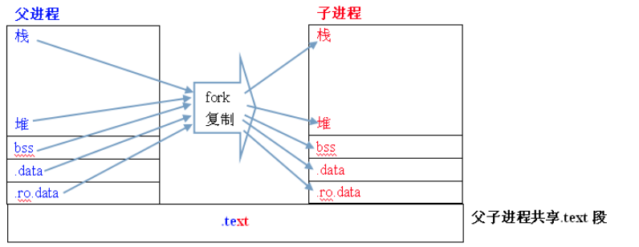
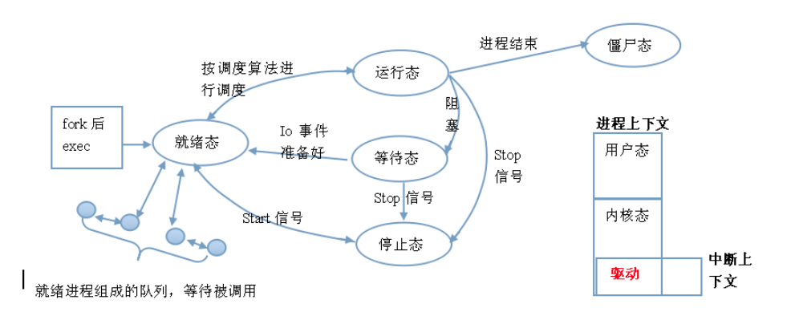
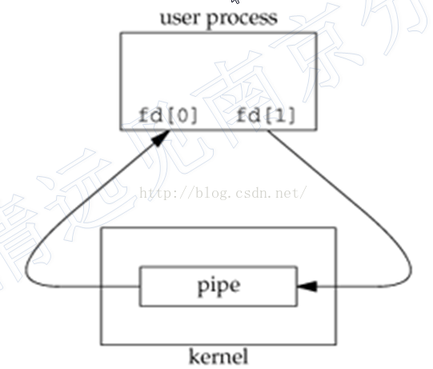

     * [进程基础](#进程基础)
           * [进程的创建](#进程的创建)
              * [fork](#fork)
                 * [fork出来的子进程会继承父进程哪些性质](#fork出来的子进程会继承父进程哪些性质)
                 * [父子进程之间的区别](#父子进程之间的区别)
              * [exec (进程替换)](#exec-进程替换)
              * [system](#system)
              * [父子进程关系](#父子进程关系)
              * [wait()](#wait)
              * [waitpid()](#waitpid)
               * [linux进程间通信](#linux进程间通信)
              * [管道](#管道)
                 * [无名管道](#无名管道)
                 * [有名管道](#有名管道)


参考：<https://www.cnblogs.com/tshua/p/5756465.html>


# 进程基础

## 进程的创建

### fork

C++的fork函数用来“复制”一份主程序，即创建主进程的子进程。调用fork的同时，我的理解是，已经在内存中创建了“副本”进程，同时返回pid，所以在返回值之前，已经是主进程和子进程同时在运行了（如果fork成功的话），这样，在程序的运行过程中，一次fork返回了两次值，在父进程中，fork返回新创建子进程的进程ID，在子进程中，fork返回0，这时候就能够同时跑两个进程了。 








```C++
//创建进程
pid_t fork (void)；

//获取进程ID
pid_t getpid();

//判断进程是否运行
if(0 == kill(pid,0));

//阻塞函数

```

```C++
#include <iostream>
#include <unistd.h>
#include "common.h"
#include<unistd.h>
#include<sys/types.h>

using namespace std;

int main() {
    pid_t pid;
    int i = 0;
    cout<<"before fork\n";
    pid = fork();
    cout<<"after fork\n";
    if (pid < 0)
    {
        cout<< "fork failed" <<endl;
    }
    else if(pid == 0)   //子进程
    {
        while (i<10) {
            cout << "I am child,i = " << i << endl;
            i += 1;
        }
        cout << "child process is " << getpid() << endl;
    }
    else{
        //父进程
        //sleep(10);
        while (i<10){
            cout<<"I am parent,i = "<<i<<endl;
            i += 2;
        }

        cout<< "parent process is " <<getpid()<<endl;
    }
    cout<<"exit process\n";
    return 0;
}

/*
before fork
after fork
after fork
I am parent,i = 0
I am parent,i = 2
I am parent,i = 4
I am parent,i = 6
I am parent,i = 8
parent process is 2066
exit process
I am child,i = 0
I am child,i = 1
I am child,i = 2
I am child,i = 3
I am child,i = 4
I am child,i = 5
I am child,i = 6
I am child,i = 7
I am child,i = 8
I am child,i = 9
child process is 2067
exit process
*/
```

我们从上面的结果中看出，fork之后的代码执行了两次，子进程是从fork之后执行的，但是变量i在fork之前就定义了，在父子进程中互不影响，说明子进程复制资源和代码，并且资源是独立的。


#### fork出来的子进程会继承父进程哪些性质

子进程继承如下性质。

1）、实际用户ID，实际组ID，有效用户ID，有效组ID，添加组ID。

2）、进程组ID（下一篇讲）。

3）、对话组ID（下一篇讲）。

4）、控制终端（下一篇讲）。

5）、设置用户ID标志和设置组ID标志。

6）、当前工作目录。

7）、根目录。

8）、文件创建方式屏蔽字。

9）、信号屏蔽额排列（第10篇讲）。

10）、对任意一打开文件描述符的在执行是的关闭标志。

11）、环境变量。

12）、连接的共享存储段。

13）、资源限制（如文件描述符个数限制）。


#### 父子进程之间的区别

1）、fork返回值不同。

2）、进程ID。

3）、不同的父进程ID。

4）、子进程的用户时间，系统时间，时钟时间都被设置为0.

5）、父进程设置的锁，子进程不能被继承。

6）、子进程从父进程继承而来的味觉警告会被清除。

7）、子进程从父进程继承来的未决信号集集会被清零。


### exec (进程替换)

### system


### 父子进程关系

**孤儿进程**

父进程先于子进程终止

父进程退出，而它子进程还在运行，这时子进程将会成为孤儿进程。

孤儿进程将会被init进程所收养，并由init进程对它们完成状态收集。

**僵尸进程**

子进程先于父进程终止

一个子进程子啊其父进程没有调用wait或waitpid的情况下退出，这个子进程就是僵尸进程

> 僵尸进程将会导致资源浪费，而孤儿则不会


头文件

```C++
#include <sys/types.h> 
#include <sys/wait.h>
```

### wait()

```c++
pid_t wait(int *status);
```

进程一旦调用wait，就会立刻阻塞自己，由wait分析是否有当前进程的某子进程已经退出，如果让它找到一个已经变成僵尸进程的子进程，wait收集这个子进程的信息，并把它彻底销毁返回，如果没有这样的进程，wait就会一直阻塞在这里，直到有一个为止。

参数status用来保存被收集进程退出时的一些状态，它是一个指向int类型的指针。但如果我们对这个子进程是如何死掉的毫不在意，只想把这个僵尸进程消灭掉，（事实上绝大多数情况下，我们都会这样想），我们就可以设定这个参数为NULL，就象下面这样： 


参数：

| value  |                   description                    |
| :----: | :----------------------------------------------: |
| 非NULL | 则终止进程的终止状态就存放在status所指向的单元。 |
|  NULL  |        则表示父进程不关心子进程的终止状态        |

返回值：

|     value      | description |
| :------------: | :---------: |
| 子进程的进程号 |    成功     |
|     返回-1     |    失败     |


例子：

```C++
#include <sys/types.h>
#include <sys/wait.h>
#include <unistd.h>
#include <stdlib.h>
#include <iostream>
using namespace std;
int main()
{
        pid_t pid;
        pid = fork();
        if(pid < 0)
        {
                cout<<"fork failed"<<endl;
        }
        else if(pid == 0)
        {
                cout<<"执行子进程"<<endl;
                sleep(10);
        }
        else
        {
                wait(NULL);
                cout<<"等待子进程结束"<<endl;
                cout<<"执行父进程"<<endl;
        }
        cout<<"进程"<<getpid()<<"执行结束"<<endl;
        return 0;
}
```

### waitpid()

```
pid_t waitpid(pid_t pid, int *status, int options);
```

参数一：需要等待的进程ID

| value  |                         description                          |
| :----: | :----------------------------------------------------------: |
| pid>0  | 只等待进程ID等于pid的子进程，不管其它已经有多少子进程运行结束退出了，只要指定的子进程还没有结束，waitpid就会一直等下去。 |
| pid=-1 | 等待任何一个子进程退出，没有任何限制，此时waitpid和wait的作用一模一样。 |
| pid=0  | 等待同一个进程组中的任何子进程，如果子进程已经加入了别的进程组，waitpid不会对它做任 |
| pid<-1 | 等待一个指定进程组中的任何子进程，这个进程组的ID等于pid的绝对值。 |


参数二：

| value  |                   description                    |
| :----: | :----------------------------------------------: |
| 非NULL | 则终止进程的终止状态就存放在status所指向的单元。 |
|  NULL  |        则表示父进程不关心子进程的终止状态        |


参数三：

|   value    |                         description                          |
| :--------: | :----------------------------------------------------------: |
|  WNOHANG   | 若由pid指定的子进程未发生状态改变(没有结束)，则waitpid()不阻塞，立即返回0 |
| WUNTRACED  |          返回终止子进程信息和因信号停止的子进程信息          |
| WCONTINUED |     返回收到SIGCONT信号而恢复执行的已停止子进程状态信息      |


返回值：

| value |    description     |
| :---: | :----------------: |
| 返回子进程的进程号 | 成功 |
|返回-1|失败|
|没有子进程退出返回0|WNOHANG|


## linux进程间通信

实现进程间通信方式有5种：

- 管道
- 信号
- 消息队列
- 信号量
- 套接字

### 管道

管道是Linux 中进程间通信的一种方式，它把一个程序的输出直接连接到另一个程序的输入，Linux 的管道主要包括两种：无名管道和有名管道。

#### 无名管道

**创建与关闭**

无名管道是基于文件描述符的通信方式。当一个管道创建时，它会创建两个文件描述符：fd[0] 、fd[1] 。其中 fd[0] 固定用于读管道，而 fd[1] 固定用于写管道



管道关闭时只需要用 close() 函数将这两个文件描述符关闭即可。

```C++
#include <unistd.h>
int pipe(int fd[2])
```

参数

| value | discription |
| ----- | ----------- |
| fd    | 文件描述符  |

返回值

| value | description |
| ----- | ----------- |
| -1    | 失败        |
| 非-1  | 成功        |


#### 有名管道


