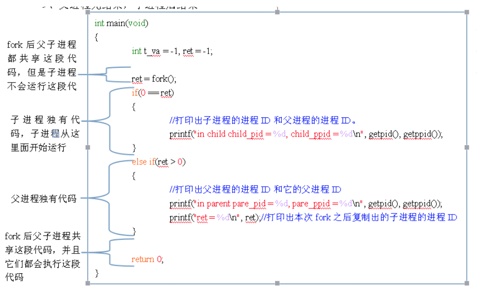

   * [进程基础](#进程基础)
      * [进程的创建](#进程的创建)
         * [fork](#fork)
            * [fork出来的子进程会继承父进程哪些性质](#fork出来的子进程会继承父进程哪些性质)
            * [父子进程之间的区别](#父子进程之间的区别)
         * [exec (进程替换)](#exec-进程替换)
         * [system](#system)
         * [父子进程关系](#父子进程关系)
         * [wait()](#wait)
         * [waitpid()](#waitpid)
      * [linux进程间通信](#linux进程间通信)
         * [管道](#管道)
            * [无名管道](#无名管道)
            * [有名管道](#有名管道)
            * [信号](#信号)
            * [消息队列](#消息队列)
            * [信号量](#信号量)
            * [套接字](#套接字)

# 进程基础

## 进程的创建

### fork

C++的fork函数用来“复制”一份主程序，即创建主进程的子进程。调用fork的同时，我的理解是，已经在内存中创建了“副本”进程，同时返回pid，所以在返回值之前，已经是主进程和子进程同时在运行了（如果fork成功的话），这样，在程序的运行过程中，一次fork返回了两次值，在父进程中，fork返回新创建子进程的进程ID，在子进程中，fork返回0，这时候就能够同时跑两个进程了。 





```c++
//创建进程
pid_t fork (void)；

//获取进程ID
pid_t getpid();

//判断进程是否运行
if(0 == kill(pid,0));

//阻塞函数

```

```C++
#include <iostream>
#include <unistd.h>
#include "common.h"
#include<unistd.h>
#include<sys/types.h>

using namespace std;

int main() {
    pid_t pid;
    int i = 0;
    cout<<"before fork\n";
    pid = fork();
    cout<<"after fork\n";
    if (pid < 0)
    {
        cout<< "fork failed" <<endl;
    }
    else if(pid == 0)   //子进程
    {
        while (i<10) {
            cout << "I am child,i = " << i << endl;
            i += 1;
        }
        cout << "child process is " << getpid() << endl;
    }
    else{
        //父进程
        //sleep(10);
        while (i<10){
            cout<<"I am parent,i = "<<i<<endl;
            i += 2;
        }

        cout<< "parent process is " <<getpid()<<endl;
    }
    cout<<"exit process\n";
    return 0;
}

/*
before fork
after fork
after fork
I am parent,i = 0
I am parent,i = 2
I am parent,i = 4
I am parent,i = 6
I am parent,i = 8
parent process is 2066
exit process
I am child,i = 0
I am child,i = 1
I am child,i = 2
I am child,i = 3
I am child,i = 4
I am child,i = 5
I am child,i = 6
I am child,i = 7
I am child,i = 8
I am child,i = 9
child process is 2067
exit process
*/
```

我们从上面的结果中看出，fork之后的代码执行了两次，子进程是从fork之后执行的，但是变量i在fork之前就定义了，在父子进程中互不影响，说明子进程复制资源和代码，并且资源是独立的。


#### fork出来的子进程会继承父进程哪些性质

子进程继承如下性质。

1）、实际用户ID，实际组ID，有效用户ID，有效组ID，添加组ID。

2）、进程组ID（下一篇讲）。

3）、对话组ID（下一篇讲）。

4）、控制终端（下一篇讲）。

5）、设置用户ID标志和设置组ID标志。

6）、当前工作目录。

7）、根目录。

8）、文件创建方式屏蔽字。

9）、信号屏蔽额排列（第10篇讲）。

10）、对任意一打开文件描述符的在执行是的关闭标志。

11）、环境变量。

12）、连接的共享存储段。

13）、资源限制（如文件描述符个数限制）。


#### 父子进程之间的区别

1）、fork返回值不同。

2）、进程ID。

3）、不同的父进程ID。

4）、子进程的用户时间，系统时间，时钟时间都被设置为0.

5）、父进程设置的锁，子进程不能被继承。

6）、子进程从父进程继承而来的味觉警告会被清除。

7）、子进程从父进程继承来的未决信号集集会被清零。


### exec (进程替换)

### system


### 父子进程关系

**孤儿进程**

父进程先于子进程终止

父进程退出，而它子进程还在运行，这时子进程将会成为孤儿进程。

孤儿进程将会被init进程所收养，并由init进程对它们完成状态收集。

**僵尸进程**

子进程先于父进程终止

一个子进程子啊其父进程没有调用wait或waitpid的情况下退出，这个子进程就是僵尸进程

> 僵尸进程将会导致资源浪费，而孤儿则不会


头文件

```C++
#include <sys/types.h> 
#include <sys/wait.h>
```

### wait()

```c++
pid_t wait(int *status);
```

进程一旦调用wait，就会立刻阻塞自己，由wait分析是否有当前进程的某子进程已经退出，如果让它找到一个已经变成僵尸进程的子进程，wait收集这个子进程的信息，并把它彻底销毁返回，如果没有这样的进程，wait就会一直阻塞在这里，直到有一个为止。

参数status用来保存被收集进程退出时的一些状态，它是一个指向int类型的指针。但如果我们对这个子进程是如何死掉的毫不在意，只想把这个僵尸进程消灭掉，（事实上绝大多数情况下，我们都会这样想），我们就可以设定这个参数为NULL，就象下面这样： 


参数：

| value  |                   description                    |
| :----: | :----------------------------------------------: |
| 非NULL | 则终止进程的终止状态就存放在status所指向的单元。 |
|  NULL  |        则表示父进程不关心子进程的终止状态        |

返回值：

|     value      | description |
| :------------: | :---------: |
| 子进程的进程号 |    成功     |
|     返回-1     |    失败     |


例子：

```C++
#include <sys/types.h>
#include <sys/wait.h>
#include <unistd.h>
#include <stdlib.h>
#include <iostream>
using namespace std;
int main()
{
        pid_t pid;
        pid = fork();
        if(pid < 0)
        {
                cout<<"fork failed"<<endl;
        }
        else if(pid == 0)
        {
                cout<<"执行子进程"<<endl;
                sleep(10);
        }
        else
        {
                wait(NULL);
                cout<<"等待子进程结束"<<endl;
                cout<<"执行父进程"<<endl;
        }
        cout<<"进程"<<getpid()<<"执行结束"<<endl;
        return 0;
}
```

### waitpid()

```
pid_t waitpid(pid_t pid, int *status, int options);
```

参数一：需要等待的进程ID

| value  |                         description                          |
| :----: | :----------------------------------------------------------: |
| pid>0  | 只等待进程ID等于pid的子进程，不管其它已经有多少子进程运行结束退出了，只要指定的子进程还没有结束，waitpid就会一直等下去。 |
| pid=-1 | 等待任何一个子进程退出，没有任何限制，此时waitpid和wait的作用一模一样。 |
| pid=0  | 等待同一个进程组中的任何子进程，如果子进程已经加入了别的进程组，waitpid不会对它做任 |
| pid<-1 | 等待一个指定进程组中的任何子进程，这个进程组的ID等于pid的绝对值。 |


参数二：

| value  |                   description                    |
| :----: | :----------------------------------------------: |
| 非NULL | 则终止进程的终止状态就存放在status所指向的单元。 |
|  NULL  |        则表示父进程不关心子进程的终止状态        |


参数三：

|   value    |                         description                          |
| :--------: | :----------------------------------------------------------: |
|  WNOHANG   | 若由pid指定的子进程未发生状态改变(没有结束)，则waitpid()不阻塞，立即返回0 |
| WUNTRACED  |          返回终止子进程信息和因信号停止的子进程信息          |
| WCONTINUED |     返回收到SIGCONT信号而恢复执行的已停止子进程状态信息      |


返回值：

| value |    description     |
| :---: | :----------------: |
| 返回子进程的进程号 | 成功 |
|返回-1|失败|
|没有子进程退出返回0|WNOHANG|


## linux进程间通信

实现进程间通信方式有5种：

- 管道
- 信号
- 消息队列
- 信号量
- 套接字

### 管道

管道是Linux 中进程间通信的一种方式，它把一个程序的输出直接连接到另一个程序的输入，Linux 的管道主要包括两种：无名管道和有名管道。

#### 无名管道

**创建与关闭**

无名管道是基于文件描述符的通信方式。当一个管道创建时，它会创建两个文件描述符：fd[0] 、fd[1] 。其中 fd[0] 固定用于读管道，而 fd[1] 固定用于写管道


> **无名管道只能用于父子进程之间的通信**


管道关闭时只需要用 close() 函数将这两个文件描述符关闭即可。

```C++
#include <unistd.h>
int pipe(int fd[2])
```

参数

| value | discription |
| ----- | ----------- |
| fd    | 文件描述符  |

返回值

| value | description |
| ----- | ----------- |
| -1    | 失败        |
| 非-1  | 成功        |

```C++
//无名管道
#include <stdio.h>
#include <stdlib.h>
#include <string.h>
#include <errno.h>
#include <unistd.h>
#include <sys/types.h>
#include <sys/wait.h>

int main(int arg, char * args[])
{
    //定义文件描述符数组
    int fdarr[2] = { 0 };
    int no = 0;
    int status;
    //create the conduit  创建一个管道 并且打开两个文件描述符
    //管道中，第一个文件描述符只读,第二个文件描述符只写
    no = pipe(fdarr);
    if (no == -1)
    {
        printf("pipe() is failed ! message :%s\n", strerror(errno));
        return -1;
    }
    //创建父子进程
    pid_t child = fork();
    if (child == -1)
    {
        printf("system is game over !\n");
        return -1;
    }
    //定义缓存字符串数组
    char buf[100] = { 0 };
    if (child == 0)
    {
        /*
         管道和文件一样，文件read函数以O_RDONLY方式打开也会阻塞，但是文件数据在本地，读取非常快，感觉不到阻塞，
         但是管道以O_RDONLY方式打开，会阻塞进程,read()函数会等待管道另一端写入数据，直到另一端关闭文件描述符
         */
        //关闭子进程中的写文件描述符--对于父子进程共享文件描述符，只在单个进程中关闭，只能将文件描述符引用减一，
        //因为父子进程中，文件描述符被引用了两次，所以需要在父子进程中分别关闭，才能使文件描述符引用次数减一
        close(fdarr[1]);
        while (read(fdarr[0], buf, sizeof(buf)) > 0)
        {
            printf("%s", buf);
            //清空缓存区
            memset(buf, 0, sizeof(buf));
        }
        //关闭子进程中读文件描述符
        close(fdarr[0]);
    } else
    {
        //关闭父进程中的读描述符
        close(fdarr[0]);
        //将键盘输入数据写入到管道中
        strcpy(buf,"fly on air!\n");
        write(fdarr[1], buf, strlen(buf));
        //关闭管道写文件描述符
        close(fdarr[1]);
        //等待子进程结束
        wait(&status);
        printf("child process is close ! message :%d\n", WEXITSTATUS(status));
    }
    return 10;
}
```


#### 有名管道

> **用于运行于同一系统中的任意两个进程间的通信**。 


```
#include <sys/types.h>
#include <sys/stat.h>
int mkfifo(const char * pathname, mode_tmode)
```

参数一

| value  | description    |
| ------ | -------------- |
| 字符串 | 有名管道文件名 |

参数二: 与打开普通文件open()函数中的mode参数相同 

返回值：

| value | description       |
| ----- | ----------------- |
| 0     | 成功              |
| -1    | 失败，errno被设置 |


#### 信号

信号是在软件层次上对中断机制的一种模拟，在原理上，一个进程收到一个信号与处理器收到一个中断请求可以说是一样的，信号是异步的，一个进程不必通过任何操作来等待信号的到达，进程也不知道信号到底什么时候到达。

信号是进程间通信机制中唯一的异步通信机制，信号机制进过POSIX实时扩展后，功能更加强大，除了基本通知功能外，还可以传递附加信息。

信号的分类：

（1）硬件异常产生的信号

（2）软件条件出发的信号

（3）用户按某些终端键时产生的信号，比如用户按CTRL+C键将会产生SIGINT信号

（4）用户使用kill命令将信号发送给进程。kill命令的语法是这样的。

（5）进程使用系统调用函数kill将信号发送一个进车或一组进程。


Linux使用信号主要有两个目的：一是让进程意识到发生一个特定的事件，二是迫使进程执行包含在其自身代码中的信号处理信号。

（1）忽略信号，进程将忽略这个信号的出现，但有两个信号不能被忽略：SIGKILL和SIGSTOP

（2）执行与这个信号相关的默认操作

（3）调用相应的信号处理函数来捕获信号，进程可以事先登记特殊的信号处理函数，当进程收到信号，信号处理函数被调用，当从信号处理函数返回后，被中断的进程将从其断点处重新开始执行。


**使用kill发送信号**

```C++
#include <sys/types.h>
#include <signal.h>
int kill(pid_t pid,int sig);
```


```C++
#include <stdio.h>
#include <stdlib.h>
#include <string.h>
#include <errno.h>
#include <unistd.h>
#include <sys/types.h>
#include <sys/wait.h>
#include <signal.h>
#include <iostream>

using namespace std;

int main(void)
{
        //创建进程
        pid_t pid = fork();
        int status;
        int retval;
        if(pid < 0)
        {
                return -1;
        }
        else if(pid == 0)
        {
                //子进程
                cout<<"In child process"<<endl;
                sleep(100);
                exit(EXIT_SUCCESS);
        }
        else if(pid > 0)
        {
                //父进程
                if(0 == (waitpid(pid,&status,WNOHANG))) //判断子进程是否已经退出
                {
                        retval = kill(pid,SIGKILL); //向pid进程发送信号

                        if(retval)
                        {
                                cout<<"kill failed.\n";
                                perror("kill");
                                waitpid(pid,&status,0);
                        }
                        else
                        {
                                cout<<pid<<" killed\n";
                        }

                }
        }
        exit(EXIT_SUCCESS);
}

/*
结果：
120199 killed
*/
```


**使用sigaction查询或设置信号处理方式**

```C++
#include <signal.h>
int sigaction(int signum, const struct sigaction *act,struct sigaction *oldact);

struct sigaction
{
    void (* sa_handler)(int);	//信号处理函数
    void (* sa_sigaction)(int ,siginfo_t *,void *); //另一个信号处理函数
    sigset_t sa_mask; //用来指定在信号处理函数执行期间需要被屏蔽的信号
    int sa_flags;
    void (* sa_restorer)(void); //已经废弃的数据域，不要使用
}
```

sa_flags

| value        | ddescription                                                 |
| ------------ | ------------------------------------------------------------ |
| SA_RESTART   | 使被信号打断的系统调用自动重新发起                           |
| SA_NOCLDSTOP | 使父进程在它的子进程暂停或继续运行时不会收到SIGCHLD信号      |
| SA_NOCLDWAIT | 使父进程在它的子进程退出时不会收到SIGCHLD信号，这是子进程如果退出，也不会成为僵尸进程。 |
| SA_NODEFER   | 使对信号的屏蔽无效，即在信号处理函数执行期间，仍能发出这个信号。 |
| SA_RESETHAND | 信号处理之后重新设置为默认的处理方式。                       |
| SA_SIGINFO   | 使用sa_sigaction成员而不是sa_handler作为信号处理函数         |


```C++
#include <stdio.h>
#include <stdlib.h>
#include <string.h>
#include <errno.h>
#include <unistd.h>
#include <sys/types.h>
#include <sys/wait.h>
#include <signal.h>
#include <iostream>

using namespace std;
//信号处理函数
static void sig_usr(int signum)
{
	if(signum == SIGUSR1)
    {
        cout<<"SIGUSR1 received\n";
    }
    else if(signum == SIGUSR2)
    {
        cout<<"SIGUSR2 received\n";
    }
    else
    {
		cout<<"signal "<<signum<<" received\n";
    }
}

int main()
{
    char buf[512];
    int n;
    struct sigaction sa_usr;
    sa_usr.sa_flags = 0;
    sa_usr.sa_handler = sig_usr; //信号处理函数
    
    sigaction(SIGUSR1,&sa_usr,NULL);
    sigaction(SIGUSR2,&sa_usr,NULL);
    cout<<"My PID is "<<getpid()<<"\n";
    while(1)
    {
        if((n = read(STDIN_FILENO,buf,511) == -1))
        {
            if(errno == EINTR)
            {
                cout<<"read is interrupted by signal\n";
            }
        }
        else
        {
            buf[n] = '\0';
            cout<<n<<"bytes read: "<<buf<<"\n";
        }
        
    }
    return 0;
}
```

```
结果：
My PID is xxxxx

kill -USR1 xxxxx

SIGUSR1 received
read is interrupted by signal
```


**系统调用sigprocmask的使用**

。。。。。。。。。。。。。。。。。


**使用sigpending检查是否挂起的信号**

。。。。。。。。。。。。。。。。。


**使用signal设置信号处理程序**

```C++
#include <signal.h>
typedef void(* sighandler_t)(int);
sighandler_t signal(int signum,sighandler_t handler);
```

参数signum

| value   | description                        |
| ------- | ---------------------------------- |
| SIG_ING | 忽略信号                           |
| SIG_DFL | 表示恢复对信号的系统默认处理方式。 |

参数handler表示自定义的信号处理函数


忽略SIGINT信号

```C++
#include <stdio.h>
#include <signal.h>

int main()
{
    signal(SIGINT,SIG_IGN);	//忽略SIGINT信号
    while(1);
    return 0;
}

/*
多次按下ctrl + C键，并没有使得程序退出。
*/
```


自定义信号SIGINT的处理

```C++
#include <stdio.h>
#include <signal.h>

typedef void (*signal_handler)(int);
void signal_hander_fun(int signum)
{
    printf("catch signal %d\n",signum); //在键盘按CTRL+C键，就会打印这个。
}

int main()
{
    signal(SIGINT,signal_hander_fun);
    while(1);
    return 0;
}
```


#### 消息队列

消息队列类似有名管道，但是没有与打开和关闭管道的复杂关联。然而，使用消息队列并没有解决有名管道所遇到的问题，例如管道的阻塞。

消息队列提供了一种在两个不相关的进程之间传递数据的而简单高效的方法，与有名管道比较起来，消息队列的优点在独立于发送与接收进程，这减少了打开与关闭有名管道之间同步的困难。

消息队列提供一种由一个进程向另一个进程发送块数据的方式。另外，每一个数据块被看作有一个类型，而接收进程可以独立接收具有不同类型的数据块。消息队列的好处在于我们几乎可以完全避免同步问题，并且可以通过发送消息屏蔽有名管道的问题。更好的是，我们可以使用某些紧急方式发送消息。坏处在于，与管道类似，在每一个数据块上有一个最大尺寸限制，同时在系统中所有消息队列的块尺寸上也有一个最大尺寸限制。

```
#include <sys/msg.h>

//生成一个键值
key_t ftok(char * fname,int id);

//创建和打开消息队列
int msgget(key_t key,int msgflg);

//获取和设置消息队列的属性
int msgctl(int msqid,int cmd,struct msqid_ds *buf);

//将消息送入消息队列的函数
int msgsnd(int msqid,const void *msgp,size_t msgsz,int msgflg);

//从消息队列中读取一条新消息的函数
int msgrcv(int msqid,void *msg_ptr,size_t msg_sz,long int msgtype,int msgflg);

```


#### 信号量

信号量本质上是一个计数器（不设置全局变量是因为进程间是相互独立的，而这不一定能看到，看到也不能保证++引用计数为原子操作）,用于多进程对共享数据对象的读取，它和管道有所不同，==它不以传送数据为主要目的==，==它主要是用来保护共享资源（信号量也属于临界资源）==，使得资源在一个时刻只有一个进程独享。

工作原理：

由于信号量只能进行两种操作==等待和发送信号==，即P(sv)和V(sv),他们的行为是这样的：

（1）P(sv)：如果sv的值大于零，就给它减1；如果它的值为零，就挂起该进程的执行

（2）V(sv)：如果有其他进程因等待sv而被挂起，就让它恢复运行，如果没有进程因等待sv而挂起，就给它加1.

在信号量进行PV操作时都为原子操作（因为它需要保护临界资源）

注：原子操作：单指令的操作称为原子的，单条指令的执行是不会被打断的


#### 套接字

见网络内容


参考：https://www.cnblogs.com/tshua/p/5756465.html