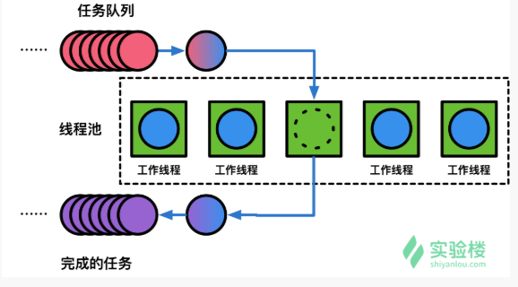

# 线程池

## 简介

多线程技术主要是解决单个处理器单元内多个线程的执行问题，由此诞生了所谓的线程池技术。线程池主要由三个基本部分组成：

1. 线程池管理器（Thread Pool):负责创建、管理线程池、最基本的操作为：创建线程池、销毁线程池、增加新的线程任务。
2. 工作线程（worker）：线程池中的线程，在没有任务时会处于等待状态，可以循环执行任务。
3. 任务队列（task Queue）：未处理任务的缓存队列。

简单来说，一个线程池负责管理了需要执行的多个并发执行的多个线程中可执行数量多的线程、以及他们之间的调度。

