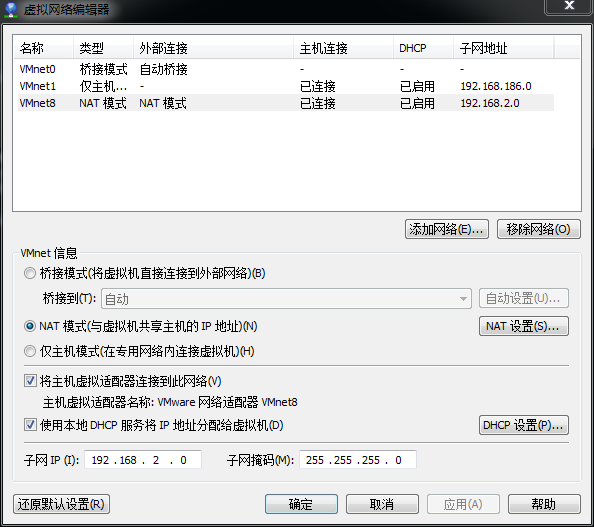
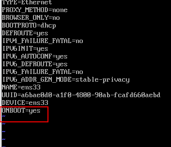
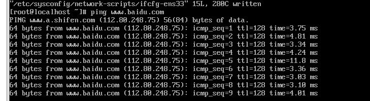

# 各种Linux安装步骤


## 一、centos最小系统安装后基本配置

在弹出的“虚拟网络编辑器”窗口中选择NAT模式的，编辑为其分配地址池：



由于安装是最小系统，安装后的不能使用网络的需要配置下

```shell
ls /etc/sysconfig/network-scripts/
```

修改网卡信息

```shell
vi /etc/sysconfig/network-scripts/ifcfg-ens33
```

将ONBOOT改为yes：



重启网络

````
service network restart
````

ping下百度

