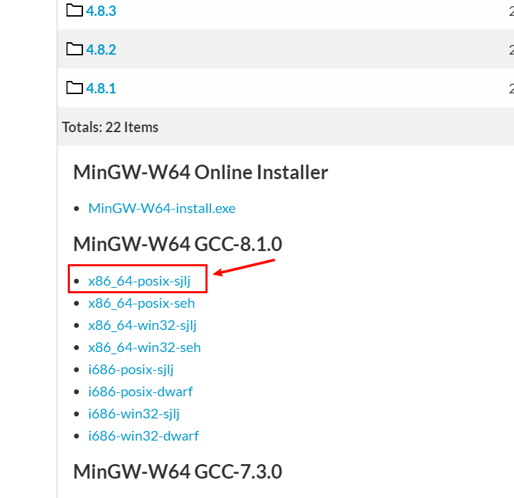
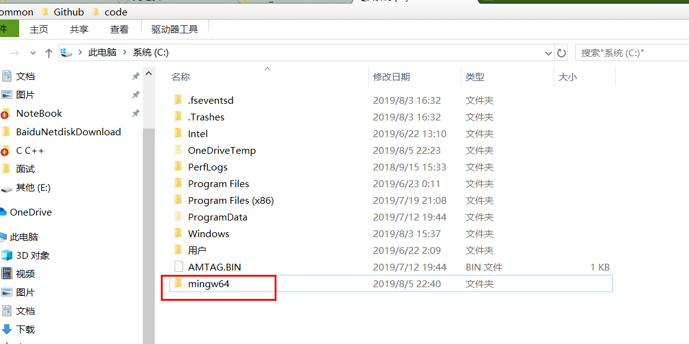
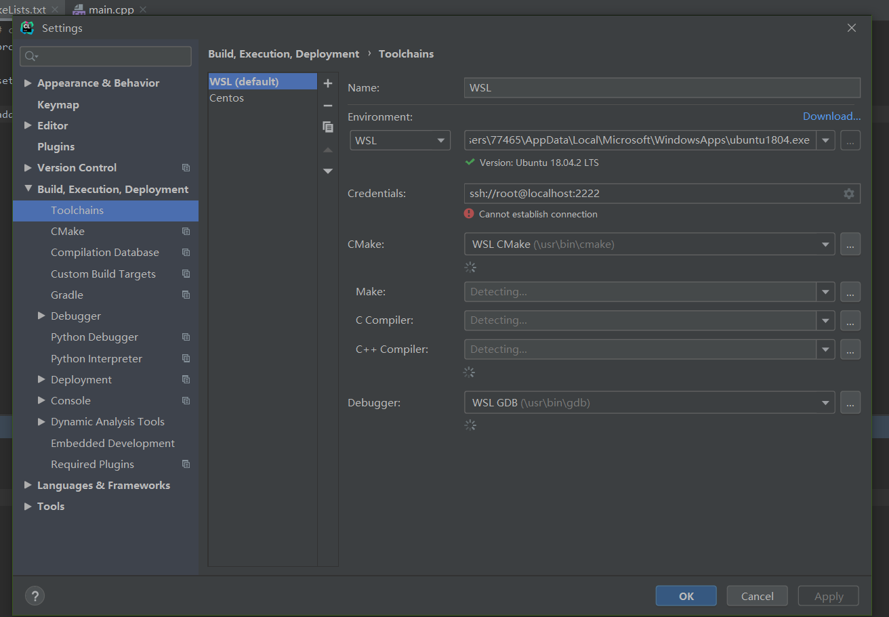
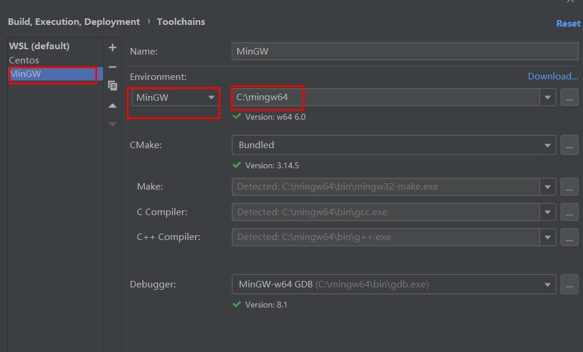
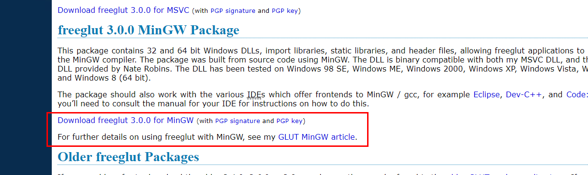

# windows上配置clion

下载**MinGW**

[MinGw]([https://sourceforge.net/projects/mingw-w64/files/Toolchains%20targetting%20Win64/Personal%20Builds/mingw-builds/](https://sourceforge.net/projects/mingw-w64/files/Toolchains targetting Win64/Personal Builds/mingw-builds/)) 点击下载

将下载的文件进行解压

打开clion的setting

# 在clion中使用openGL

1、首先下载freeglut https://www.transmissionzero.co.uk/software/freeglut-devel/

选择for mingw版本的

2、打开压缩包，里面有bin，include，lib三个文件夹

a、将压缩包/include/GL中的文件拷贝到mingw/include/GL文件夹下

b、64位机的话将压缩包/lib/x64中的.a文件拷贝到mingw/lib文件夹下，32位机的话应该拷的是压缩包/lib中的两个.a文件

c、64位机把压缩包/bin/x64里的文件拷贝到C://Windows//SysWOW64下，32位机压缩包/bin下文件到C://Windows//System32下

3、新建CLion工程，修改CMake文件