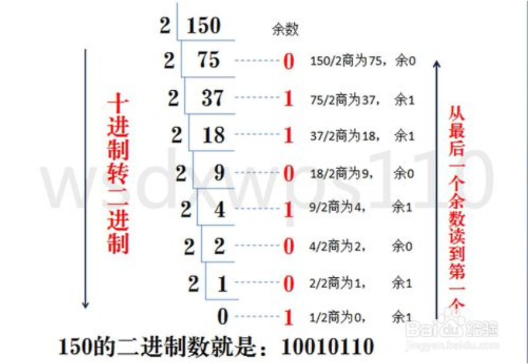
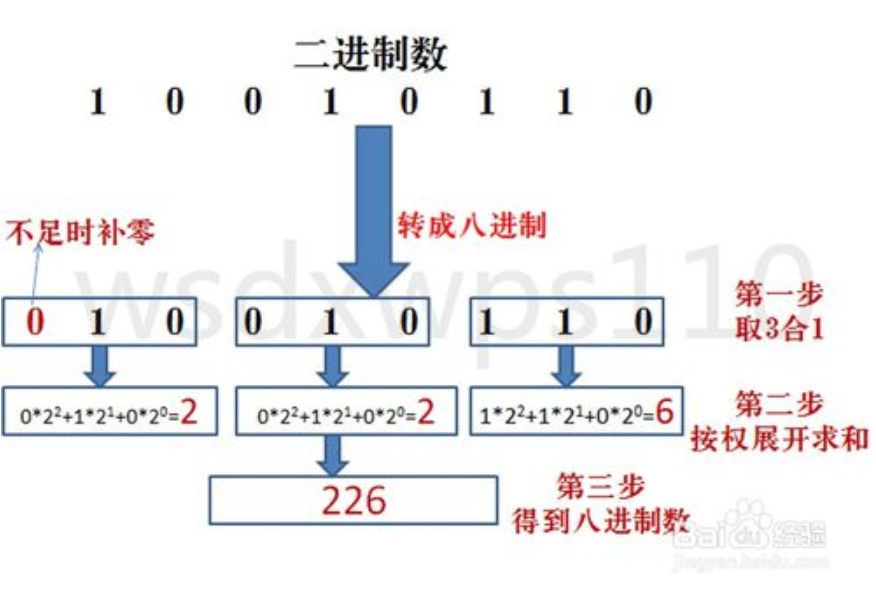
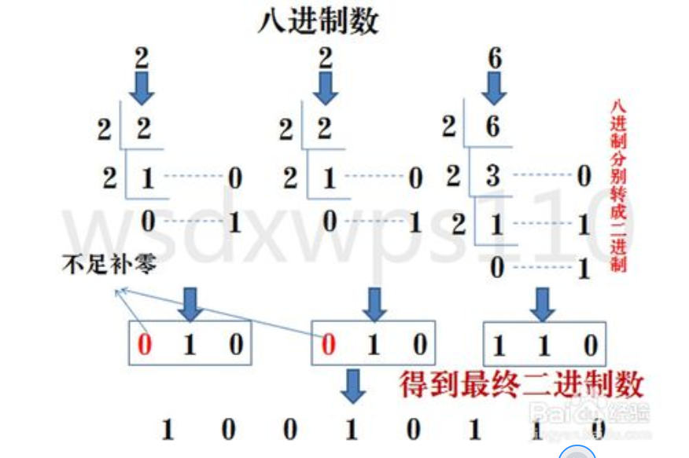
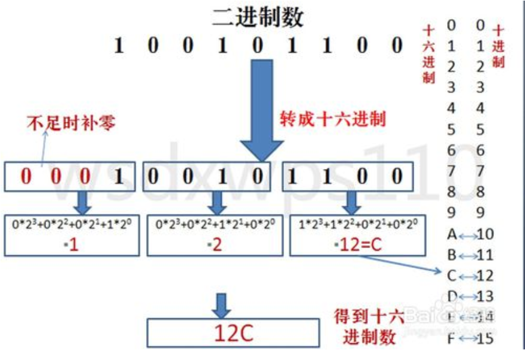
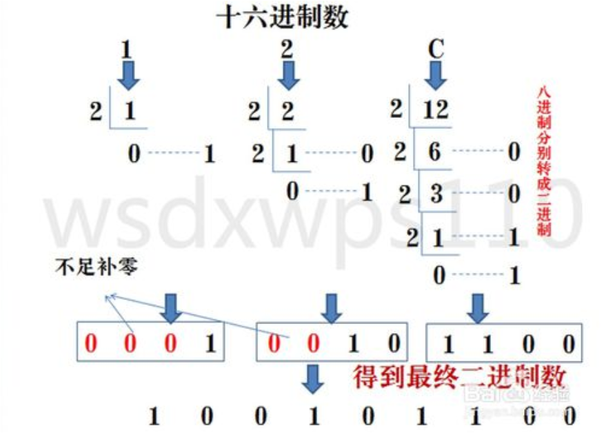
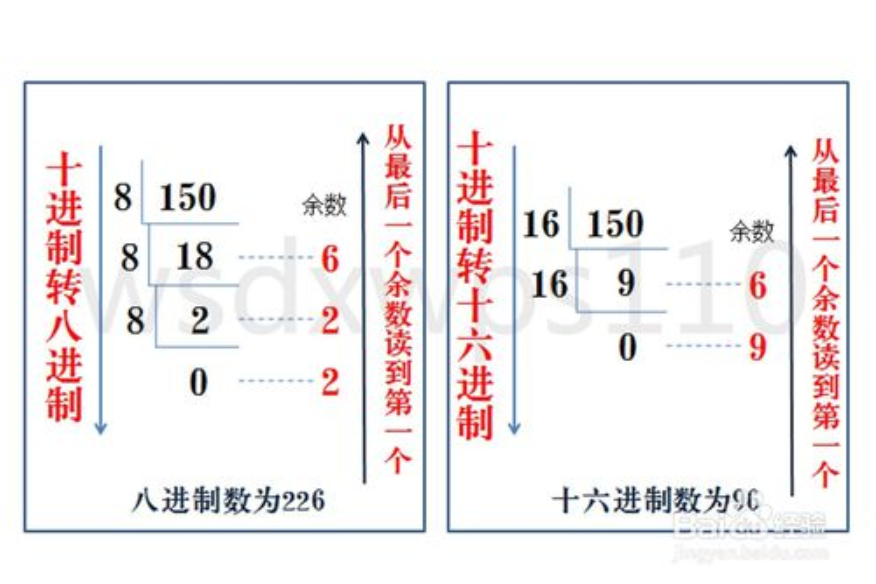
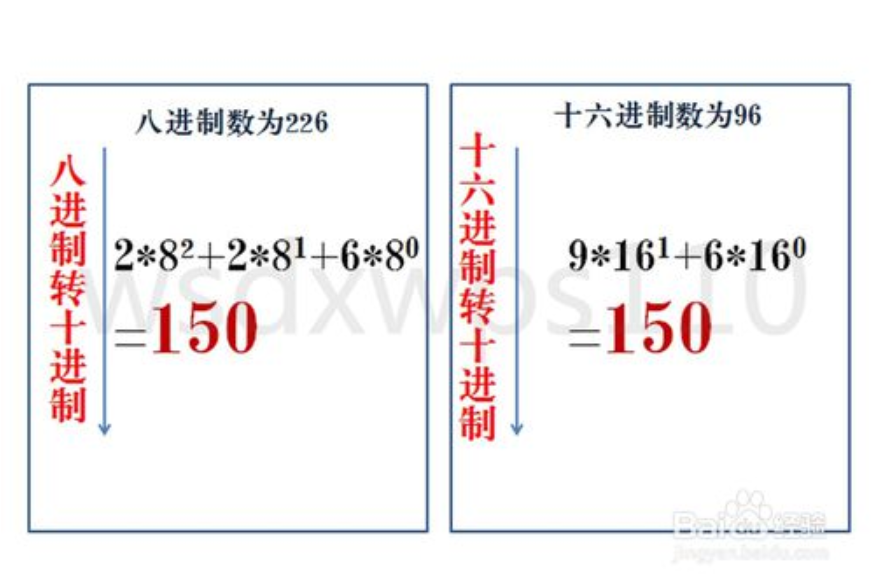

# 进制

进制是一种计量方式，在计算机的内存中是以二进制的补码形式存储的，日常生活中，我们通常使用十进制进行数据计算，内存的地址是以十六进制形式展现的，linux系统的权限是以八进制进行运算的。

十进制：逢十进一

二进制：逢二进一

八进制：逢八进一

十六进制：逢十六进一

进制之间的转换

十进制转换为二进制

即十进制数除2，余数为权位上的数，得到的商值继续除2，依此步骤继续向下运算直到商为0为止。

二进制转十进制

方法为：把二进制数按权展开、相加即得十进制数。

二进制转八进制

方法为：3位二进制数按权展开相加得到1位八进制数。（注意事项，3位二进制转成八进制是从右到左开始转换，不足时补0）。

八进制转成二进制

方法为：八进制数通过除2取余法，得到二进制数，对每个八进制为3个二进制，不足时在最左边补零。

二进制与十六进制之间的转换
---

二进制转十六进制

方法为：与二进制转八进制方法近似，八进制是取三合一，十六进制是取四合一。（注意事项，4位二进制转成十六进制是从右到左开始转换，不足时补0）。

十六进制转二进制

方法为：十六进制数通过除2取余法，得到二进制数，对每个十六进制为4个二进制，不足时在最左边补零。

十进制与八进制与十六进制之间的转换
---

十进制转八进制或者十六进制有两种方法

第一：间接法—把十进制转成二进制，然后再由二进制转成八进制或者十六进制。这里不再做图片用法解释。

第二：直接法—把十进制转八进制或者十六进制按照除8或者16取余，直到商为0为止。

八进制或者十六进制转成十进制

方法为：把八进制、十六进制数按权展开、相加即得十进制数。

十六进制与八进制之间的转换
---

八进制与十六进制之间的转换有两种方法

第一种：他们之间的转换可以先转成二进制然后再相互转换。

第二种：他们之间的转换可以先转成十进制然后再相互转换。